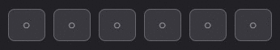

# react-pin-input-hook

React hook for entering a PIN code.

<div align="center">
  <a href="https://www.npmjs.com/package/react-pin-input-hook">
    
  </a>
</div>

## Installation

```
// with npm
npm install --save react-pin-input-hook

// with yarn
yarn add react-pin-input-hook
```

## Usage example

### Uncontrolled

```typescript jsx
import * as React from 'react'
import { usePinInput } from 'react-pin-input-hook'

function Component() {
  const { fields } = usePinInput({
    onComplete: (value) => {
      // Here you can make asynchronous requests to your API for verification.

      console.log(value)
    },
  })

  return (
    <div className='pin-input'>
      {fields.map((propsField, index) => (
        <input key={index} className='pin-input__field' {...propsField} />
      ))}
    </div>
  )
}
```

### Controlled

```typescript jsx
import * as React from 'react'
import { usePinInput } from 'react-pin-input-hook'

function Component() {
  const [values, setValues] = React.useState(Array(6).fill(''))
  const { fields } = usePinInput({
    values,
    onChange: (values) => {
      setValues(values)
    },
  })

  return (
    <div className='pin-input'>
      {fields.map((propsField, index) => (
        <input key={index} className='pin-input__field' {...propsField} />
      ))}
    </div>
  )
}
```

## Options

| Prop          | Type                                           | Default             | Description                                                                                                                                    |
| ------------- | ---------------------------------------------- | ------------------- | ---------------------------------------------------------------------------------------------------------------------------------------------- |
| values        | string[]                                       | -                   | Field values. If no values are passed, the default value defined in `defaultValues` is used.                                                   |
| onChange      | (values: string[]) => void                     | -                   | The function is called every time the value changes.                                                                                           |
| onComplete    | (value: string) => void                        | -                   | The function is called when all fields are filled in.                                                                                          |
| actionRef     | React.Ref<[PinInputActions](#PinInputActions)> | -                   | A reference to imperative actions.                                                                                                             |
| autoFocus     | boolean                                        | false               | Automatic focus setting at the first mount, is set to the first field.                                                                         |
| defaultValues | string[]                                       | ['','','','','',''] | In the case when the component is unmanaged, default values are set, where the number of values in the array is equal to the number of fields. |
| type          | 'numeric' or 'alphanumeric'                    | 'numeric'           | Changes the type of keyboard display on mobile devices.                                                                                        |
| otp           | boolean                                        | false               | If `true`, then the attribute `autocomplete=“one-time-code”` is added, otherwise `autocomplete=“off”`.                                         |
| placeholder   | string                                         | '○'                 | Placeholder for the `input` element.                                                                                                           |
| disabled      | boolean                                        | false               | If `true`, the transmission of event handlers `onChange`, `onBlur`, `onFocus` and `onKeyDown` in the parameters of each field is prevented.    |
| mask          | boolean                                        | false               | If `true`, then the attribute `type="password"` is set, otherwise `type="text"`.                                                               |
| error         | boolean                                        | false               | If `true`, then the focus behavior on the fields changes.                                                                                      |

## Return

| Prop      | Type                                        | Default          | Description                                                                                                                                         |
| --------- | ------------------------------------------- | ---------------- | --------------------------------------------------------------------------------------------------------------------------------------------------- |
| fields    | [PinInputFieldProps](#PinInputFieldProps)[] | -                | An array of objects with attributes.                                                                                                                |
| isFocused | boolean                                     | -                | Whether the focus was set on any field.                                                                                                             |
| clear     | (options?: { focus?: boolean }) => void     | { focus: false } | Sets the initial values of the fields. Removes focus by default. The parameter can be passed `{ focus: true }` to set the focus on the first field. |

## PinInputFieldProps

| Prop         | Type                                                 | Descriptions                                                                                   |
| ------------ | ---------------------------------------------------- | ---------------------------------------------------------------------------------------------- |
| ref          | React.RefCallback<HTMLInputElement>                  | Returns a callback function to register the field.                                             |
| value        | string                                               | Returns the value of the field.                                                                |
| disabled     | boolean                                              | Returns the value passed by the `disabled` parameter.                                          |
| autoComplete | 'one-time-code' or 'off'                             | Returns either `one-time-code` if the parameter `otp: true` was passed, otherwise `off`.       |
| inputMode    | 'text' or 'numeric'                                  | Returns either `text` if the parameter `type: 'alphanumeric'` was passed, otherwise `numeric`. |
| type         | 'text' or 'password'                                 | Returns either `password` if the `mask: true` parameter was passed, or `text`.                 |
| placeholder  | string                                               | Returns the value passed by the `placeholder` parameter if there are no focused fields.        |
| onBlur       | (event: React.FocusEvent<HTMLInputElement>) => void  | Returns the handler for the focus loss event if `disabled: false`.                             |
| onFocus      | (event: React.FocusEvent<HTMLInputElement>) => void  | Returns the handler for the focus appearance event if `disabled: false`.                       |
| onChange     | (event: React.ChangeEvent<HTMLInputElement>) => void | Returns a handler for the field change event if `disabled: false`.                             |
| onKeyDown    | (event: React.ChangeEvent<HTMLInputElement>) => void | Returns a handler for the keystroke event if `disabled: false`.                                |

## PinInputActions

| Name  | Type                     | Description                                                                                                                                                                                                                                                                |
| ----- | ------------------------ | -------------------------------------------------------------------------------------------------------------------------------------------------------------------------------------------------------------------------------------------------------------------------- |
| blur  | () => void               | Imperative function call to lose focus.                                                                                                                                                                                                                                    |
| focus | (index?: number) => void | Imperative function call to set focus on the first empty field. In the case when `error: true`. the focus is set to the first empty field. The argument takes an optional parameter in the form of a number (ordinal index), which will set the focus on a specific field. |

### Example

```typescript jsx
import * as React from 'react'
import { usePinInput, PinInputActions } from 'react-pin-input-hook'

function Component() {
  const [values, setValues] = React.useState(['', '', '', '', '', ''])
  const [error, setError] = React.useState(false)
  const actionRef = React.useRef<PinInputActions>(null)
  const { fields } = usePinInput({
    values,
    onChange: setValues,
    error,
    actionRef,
  })

  const onSubmit = () => {
    // Check if there is at least one empty field. If there is, the input is considered empty.
    if (values.includes('')) {
      // Setting the error.
      setError(true)
      // We set the focus on the first empty field if `error: true` was passed as a parameter in `options`.
      actionRef.current?.focus()
    }
  }

  return (
    <form>
      <div className='pin-input'>
        {fields.map((propsField, index) => (
          <input key={index} className='pin-input__field' {...propsField} />
        ))}
      </div>
      <button onClick={onSubmit}>Submit</button>
    </form>
  )
}
```
